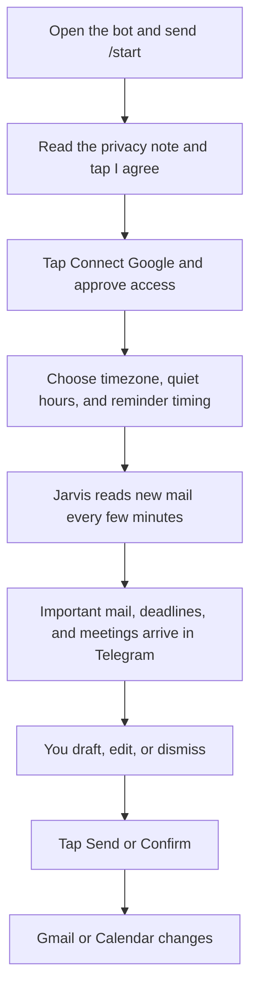
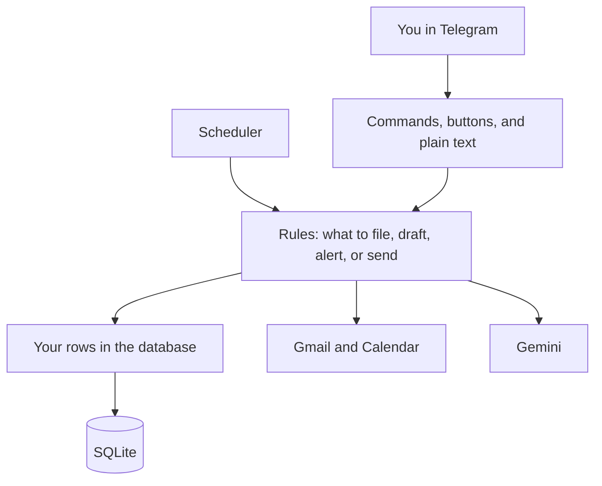

# Jarvis — Personal Executive Agent

Jarvis is a Telegram bot that watches your Gmail, files what matters, keeps deadlines and meetings in view, and drafts replies. You talk to it in Telegram. Nothing is sent, and nothing on your calendar is changed, until you tap confirm.

## The problem

A busy inbox mixes the mail you must answer with newsletters, receipts, one-time codes, and promotions. Deadlines hide in the middle of a thread. Meetings sit in a different app. Drafting a reply means opening Gmail, finding the thread, and writing it yourself.

Checking all of that from a phone is slow, and it is easy to send something you did not mean to send.

## The solution

You connect one Google account from Telegram. Jarvis reads new mail, files it into folders, and messages you only when something needs you. It drafts replies and new emails and shows you the full text first. You tap Send. Until that tap, Gmail and Calendar stay unchanged.

Each Telegram user has their own mailbox, their own settings, and their own stored data. One Google address cannot be linked to two Telegram accounts.

## A day with Jarvis



1. Send `/start`. Jarvis introduces itself and offers **Privacy note**, **Connect Google**, and **How it works**.
2. Open the privacy note and tap **I agree**. Connect Google stays closed until you agree.
3. Tap **Connect Google**. A one-time link opens Google's consent screen. The link expires in 10 minutes. After you approve, Google sends you back to a short success page.
4. Choose your timezone, quiet hours, and how far ahead reminders should fire. When that finishes, `/start` says you are connected and shows buttons for Today, Important, Folders, Schedule meet, Settings, and Help.
5. From then on, new mail is read about every two minutes. The first successful connection also loads mail from the last 7 days.
6. Important mail arrives as a Telegram message with reply buttons. Newsletters and one-time codes do not ping you.
7. When you want a reply or a new email, Jarvis shows who it is to, the subject, and the body. **Send** is a separate tap. **Cancel** sends nothing.
8. `/today` is the daily view: meetings that are already on your calendar, deadlines due within 24 hours, and replies you still owe.

If Google later rejects the saved login, sync stops for that account only and Jarvis asks you to connect again.

## Features

### Mail that needs you

Jarvis classifies each new message. Work, personal, academic, finance, and meeting mail can raise an alert. Newsletters, promotions, and one-time codes are filed and kept quiet. You can mute a sender, mark someone as VIP, and set an importance bar (the default is 60). Critical alerts and suspected phishing still arrive during quiet hours and during focus mode.

`/brief` is the morning briefing. `/wrapup` is the evening summary. Both can also arrive on their own at the times you set (defaults are 08:00 and 20:00 in your timezone). Empty sections are left out.

### Smart folders

Folders are views stored by Jarvis. They do not move or delete mail in Gmail. One message can sit in more than one folder.

Open `/folders` for the grid. These views are also available as commands, and they are hidden from the main menu so the menu stays short:

| Folder | What you find there |
| --- | --- |
| Meets, Deadlines, Tasks, Waiting | Invites, dates, explicit asks, and replies |
| Important | Mail that is not bulk |
| Jobs, Hackathons, Events, Scholarships, Opportunities | Postings, with a fit score where Jarvis can score one |
| Bills, Orders, Travel, Finance, Academics | Money, deliveries, trips, and college |
| OTPs | Login codes. No push alert. Reveal shows the code, then that Telegram message is deleted after 60 seconds |
| Newsletters, Filtered | Digests kept out of the main briefing |
| Spam | Suspected phishing, with the reasons |
| VIP, Saved, Archive | People you marked, items you kept, and items you dismissed |

You can add a custom folder in a sentence, for example `create folder Research for emails from my professor and arXiv`. Jarvis repeats the keywords and saves the folder only after you reply `yes`.

Jobs and hackathons are scored against `/interests`. On a card you can tap **Interested**, **Applied**, or **Not for me**.

Gmail labels stay off unless you turn them on. Even then, a label is applied only after you confirm.

### Deadlines and tasks

Dates found in mail become deadlines. A phrase such as "today" is read in your timezone on the day the email arrived, so an old "today" is overdue rather than still upcoming. `/deadlines` splits upcoming dates from missed or overdue ones.

Explicit asks become tasks. Newsletter buttons such as "unsubscribe" are not stored as tasks. `/tasks` lists what is open. `/done t12` or `/done d3` marks one done. `/snooze t12` moves it to tomorrow morning.

### Meetings

`/meet` lists today's calendar events and includes a join link when the event has one. `/today` includes that same list, plus deadlines due within 24 hours and replies you owe.

If a meeting is detected in mail, it stays a proposal until you confirm it. Confirm creates the Google Calendar event. Edit and ignore are the other choices. Jarvis does not create, change, or delete a calendar event on its own.

Scheduling a brand-new meeting from chat, emailing invites, and rescheduling are not available yet. The **Schedule meet** button on the welcome screen opens today's meeting list.

### Replies and new mail

On an alert that needs a reply you can choose **Short**, **Detailed**, or **Decline**, or the quicker **Yes**, **Thanks**, and **Later**. You can also ask for a draft of the thread, then make it shorter, more formal, more friendly, or regenerate it. **Edit** lets you replace the text with your next message.

`/suggest reply yes and ask for the invoice` expands that instruction and still does not send.

`/mail priya@college.edu asking her to share the invoice by Friday` writes a new email from those words only. You can also type `email priya@college.edu the report will be ready on Friday`. Jarvis does not invent dates, prices, or files you did not mention. If the draft says "attached" and there is no file, the preview says so.

`/templates save Thanks :: Thanks for your time, {name}.` stores a reusable reply. `{name}` and `{date}` are filled in when you use it.

### Search

`/search your question`, or a normal sentence such as "what's pending this week?", looks through mail Jarvis has already stored and answers from those rows.

### Quiet hours, focus, and reminders

Quiet hours default to 22:00–07:00. Ordinary mail waits. Critical alerts and phishing do not.

`/focus 2h` holds ordinary alerts for that long. `/focus off` ends it. Critical items and phishing still come through.

Reminders that are already stored are delivered every minute. In `/settings` → **Reminders** you can see the lead times and turn **Reminders override quiet hours** on or off. It starts on. Cards that fire 6 hours before a deadline and 30 minutes before a meeting are a later step. The lead times are saved so that step can use them.

### Settings and your account

`/settings` is a button menu:

| Button | What you can do |
| --- | --- |
| Reminders | See lead times and toggle whether reminders override quiet hours |
| Quiet hours | See the window. Change it with `quiet 22:00-07:00` |
| Timezone | See the zone. Change it with `timezone Asia/Kolkata` |
| Notifications | See which categories currently notify you |
| Folders | Open the folder grid |
| Interests | Topics used to score jobs and hackathons |
| Account | Disconnect Google, or delete your data |

`/disconnect` revokes Google. You can keep the mail Jarvis stored or delete it. `/deleteme` does not erase anything on a second tap. It asks you to type the word `DELETE`. Any other message cancels. Only that user's rows are removed.

`/pause` stops sync and ordinary alerts. `/resume` starts them again. Settings, disconnect, and delete stay available while paused.

## Commands

The Telegram menu lists these twelve:

| Command | What it does |
| --- | --- |
| `/start` | Intro for a new user, or welcome back when Google is connected |
| `/today` | Today's meetings with join links, deadlines due within 24 hours, pending replies |
| `/brief` | Morning briefing |
| `/meet` | Today's meetings and join links |
| `/deadlines` | Upcoming dates, and missed or overdue ones |
| `/tasks` | Open tasks |
| `/folders` | Folder grid |
| `/waiting` | Replies you owe, and replies you are waiting on |
| `/mail` | Draft a new email. Send waits for your tap |
| `/search` | Find mail in plain language |
| `/settings` | Reminders, quiet hours, timezone, notifications, folders, interests, account |
| `/help` | Each function once, grouped |

Older names still work. They are hidden so the menu stays at twelve.

| You can still type | It runs |
| --- | --- |
| `/compose` | `/mail` |
| `/followups` | `/waiting` |
| `/categories`, `/menu` | `/folders` |
| `/preferences` | `/settings` |
| `/important` | The Important section of `/brief` |
| `/unread` | The Unread section of `/brief` |
| `/free` | `/meet` |

`/jobs`, `/hackathons`, `/bills`, `/otps`, `/spam`, and the other folder names in the table above also still work. `/privacy`, `/disconnect`, `/deleteme`, `/status`, `/errors`, `/history`, `/pause`, `/resume`, `/focus`, `/templates`, `/suggest`, `/interests`, `/done`, and `/snooze` stay available and stay off the menu.

## How it is built

Telegram is the only interface. A small web port exists so Google can redirect back after consent, and so a health check can see that the process is up.



| Layer | Responsibility |
| --- | --- |
| Handlers | Read your message or button and call one service |
| Services | Decide what happens: classify, file, draft, alert, approve |
| Repositories | Read and write the database. A query for your data always includes your user id |
| Google clients | Read mail, send a message you approved, and change the calendar you approved |
| Gemini client | Classify, draft, summarize, and answer search questions. The model names live in `GEMINI_MODEL_CHAIN` and are tried in order |

Email text is treated as untrusted. It is wrapped before it reaches the model. Text inside an email cannot send mail, change your calendar, or change your settings. Those actions start from your Telegram messages and button taps, then wait on an approval that expires.

The stack is Python 3.11, python-telegram-bot, Google OAuth, Gemini, SQLAlchemy, Alembic, APScheduler, and encrypted token storage.

A closer file map is in [docs/architecture.md](docs/architecture.md).

## Safety and privacy

- Send, calendar create, calendar update, calendar delete, and label apply wait for a confirmation. The confirmation expires if you leave it. The audit log stores a short summary, not the message body.
- Google tokens are encrypted with a key derived for that user. They are not written to logs.
- One-time codes are stored encrypted, shown masked, and the message body is cleared after 24 hours. Other message bodies are cleared after the retention window (`BODY_RETENTION_DAYS`, default 30).
- `/deleteme` removes only the rows that belong to the person who typed `DELETE`.
- `GET /health` returns `{"status":"ok"}` and no mailbox data. The log console stays off unless `CONSOLE_ENABLED=true`. When it is on, only this computer can open it.

The Google consent screen asks to read mail, send mail you approved, change labels you approved, and manage calendar events you approved. The exact scopes are in [docs/scopes.md](docs/scopes.md).

## What is not built yet

- A Sunday weekly review.
- Separate follow-up nudges at 4 hours, 24 hours, and 48 hours. One nudge interval runs today (`FOLLOWUP_NUDGE_HOURS`).
- Reminder cards at 6 hours before a deadline and 30 minutes before a meeting.
- Creating a meeting from chat, sending invites, or rescheduling.
- Meeting-prep alerts at 24 hours, 1 hour, and 10 minutes.
- Voice notes, and a resume upload that seeds your interests.

## Setup and run

You need a Telegram bot token, a Gemini API key, a Fernet key, and a Google **Web application** OAuth client. Full steps are in [SETUP.md](SETUP.md).

The redirect URI Google must allow, character for character, is:

`https://<your-host>/oauth/google/callback`

Set `PUBLIC_BASE_URL` to `https://<your-host>` with no path on the end. A desktop OAuth client cannot use that address. If Google shows **Error 400: redirect_uri_mismatch** or **Access blocked**, the client type is wrong or the URI on the client does not match the line above. A Cloudflare quick tunnel hostname changes every time the tunnel restarts, so both `.env` and the Google client have to be updated together.

```bash
python -m venv .venv
.venv\Scripts\activate
pip install -r requirements.txt
copy .env.example .env
python -m app.main
```

Demo mode reads `tests/fixtures` and does not call Google:

```bash
# APP_MODE=demo in .env
python scripts/seed_sample_emails.py
python -m app.main
```

## Scheduled work

| Job | When | What it does |
| --- | --- | --- |
| Poll inbox | Every 2 minutes | Sync, classify, file into folders, clear old bodies, send due alerts |
| Reminders | Every minute | Deliver reminders that are already due |
| Follow-up nudge | Hourly | Nudge an open follow-up after the configured age |
| Digests | Each minute, at the configured clock time | Morning briefing and evening wrap-up, once per local day |
| Expire approvals | Every 5 minutes | Close confirmations that were not answered |

## More detail

| Topic | Document |
| --- | --- |
| Install, Google client, and the redirect URI | [SETUP.md](SETUP.md) |
| Product status and how a message moves | [docs/PROJECT.md](docs/PROJECT.md) |
| Folders and their buttons | [docs/folders.md](docs/folders.md) |
| Accounts and data isolation | [docs/multiuser.md](docs/multiuser.md) |
| Meetings | [docs/meetings.md](docs/meetings.md) |
| Reminders and quiet hours | [docs/reminders.md](docs/reminders.md) |
| OAuth scopes | [docs/scopes.md](docs/scopes.md) |
| File map | [docs/architecture.md](docs/architecture.md) |
| History | [CHANGELOG.md](CHANGELOG.md) |
