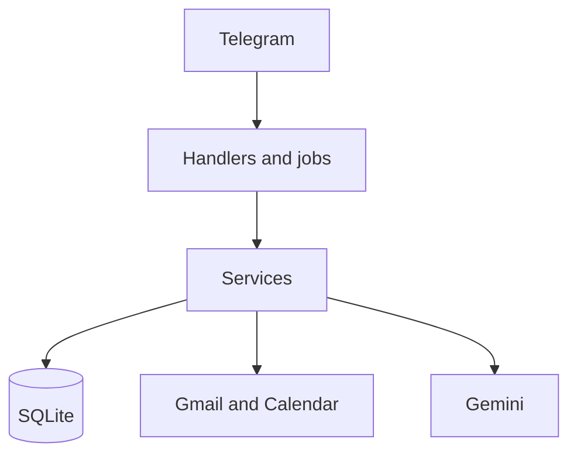

# Personal Executive Agent

A Telegram bot that watches Gmail, files mail into folders, drafts replies and new emails for your approval, and keeps calendar, deadlines, tasks, and follow-ups in one place. Telegram is the only interface. Nothing is sent or changed until you tap a confirmation.

The full description, progress, and function list are in [docs/PROJECT.md](docs/PROJECT.md).

## What it does

- Polls Gmail with history ids and skips messages it has already stored.
- Skips obvious newsletters before calling Gemini, then stores category, importance, urgency, tasks, deadlines, and meetings.
- Alerts you on Telegram, respecting quiet hours, muted senders, and a per-category switch.
- Drafts a reply you can edit, shorten, or change tone. Send happens only after you tap Send, in the original thread.
- Detects meetings, warns about conflicts, and creates the Google Calendar event after you confirm.
- Tracks tasks, deadlines, reminders, and follow-ups.
- Sends a morning briefing and an evening wrap-up.
- Answers plain-English questions from the local mailbox.
- Learns VIP, mute, and writing-style preferences you can inspect.
- Writes every mutating action to an append-only audit log.



Email text is untrusted. It is wrapped before it reaches Gemini, and it cannot send mail or change the calendar. Those actions start only from your messages and button taps, then wait on an approval that expires.

## Commands

| Command | What it does |
| --- | --- |
| `/start` | Register this chat and show the intro |
| `/help` | Command and preference reference |
| `/brief` | Morning briefing |
| `/wrapup` | Evening wrap-up |
| `/important` | High-importance mail |
| `/unread` | Unread mail |
| `/tasks` | Open tasks (`t12`) |
| `/deadlines` | Open deadlines (`d3`) |
| `/followups` | Replies you owe and replies you are waiting on |
| `/calendar` | Today. `/calendar week` shows the week |
| `/search your question` | Natural-language search |
| `/history` | Audit log |
| `/preferences` | Timezone, quiet hours, tone, VIPs, muted senders |
| `/categories` | Category counts |
| `/pause` | Stop sync and notifications |
| `/resume` | Resume |
| `/status` | Last sync, queue size, errors |
| `/done t12` | Complete a task or `d3` deadline |
| `/snooze t12` | Snooze until tomorrow morning |

You can also type things like `what's pending this week?`, `tone formal`, `quiet 22:00-07:00`, `timezone Asia/Kolkata`, `vip add name@example.com`, or `mute name@example.com`.

## Run

See [SETUP.md](SETUP.md) for Telegram, Google Cloud, and Gemini credentials.

```bash
python -m venv .venv
.venv\Scripts\activate
pip install -r requirements.txt
copy .env.example .env
python -m app.main
```

Demo mode reads `tests/fixtures` instead of Gmail:

```bash
# in .env: APP_MODE=demo
python scripts/seed_sample_emails.py
python -m app.main
```

Docker:

```bash
docker compose up --build
```

Health check: `GET /health` on port 8081. The operations console is `http://127.0.0.1:8081/` and shows the redacted backend log.

## Tests

```bash
python -m pytest
python -m ruff check app tests scripts
python -m mypy app
python -m app.main --check
```

## Layout

Handlers and jobs call services. Services call repositories, Google clients, and Gemini. Prompts live in `app/ai/prompts/`. Details are in [docs/architecture.md](docs/architecture.md). Scopes are in [docs/scopes.md](docs/scopes.md).
