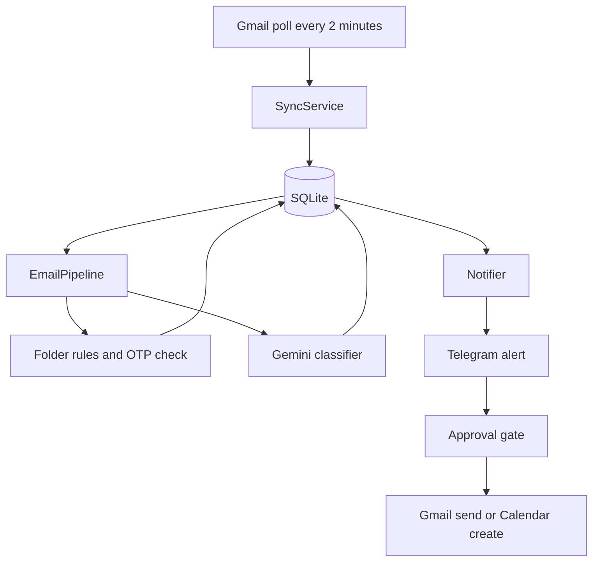
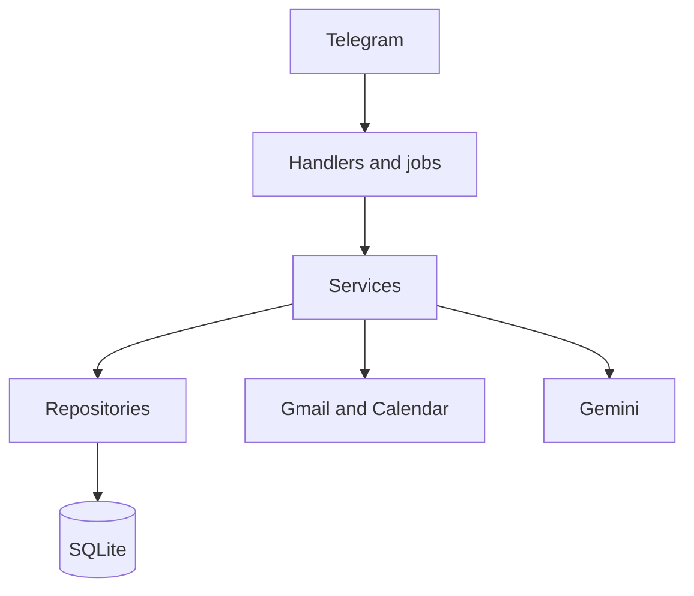

# Personal Executive Agent

A Telegram bot that watches one Gmail account, files mail into local folders, drafts replies and new emails, and keeps deadlines, tasks, meetings, and follow-ups in one place. Telegram is the only interface. Gmail and Calendar change only after an explicit approval.

The guide for a person using the bot — problem, solution, features, the path from `/start` through a confirmed send, and architecture — is [README.md](../README.md). History is in [CHANGELOG.md](../CHANGELOG.md). Install steps are in [SETUP.md](../SETUP.md).

## Purpose

The owner should be able to open Telegram and see what needs attention, without living in the Gmail inbox.

The agent:

- Syncs Gmail and classifies each message.
- Files one message into one or more virtual folders. Gmail labels are not changed unless label application is turned on, and even then only after approval.
- Alerts on important mail, and stays quiet for newsletters, codes, and muted senders.
- Drafts replies and brand-new emails, shows the full text, and sends only when the owner taps Send.
- Tracks deadlines against the date the email arrived, so an old "today" is overdue.
- Scores jobs, hackathons, and scholarships against an interest profile.

## Current status

Each Telegram user connects one Google mailbox from `/start`. The Telegram menu lists **12 commands**. Older commands stay as hidden aliases. Alembic head is `0006_user_uniques`. The database upgrades when the process starts.

Model names come from `GEMINI_MODEL_CHAIN` in the environment. The client tries them in order on 429, 503, or 404. The latest local check is in [verification_report.md](verification_report.md).

| Area | State |
| --- | --- |
| Gmail sync, classification, alerts, briefing | Working |
| Approval-gated reply and new mail | Working |
| Calendar create after approval | Working |
| Tasks, deadlines, follow-ups, reminders | Working |
| Signup and 7-day backfill | Working |
| Virtual folders, OTP vault, spam, opportunities | Working in the bot and covered by tests |
| Reply variants, templates, focus mode, custom folders | Working |
| Compose a new email from an address and a note | Working |
| Voice notes, Sunday review, scheduled send, meeting prep | Not built |

## Progress

Moved to [CHANGELOG.md](CHANGELOG.md).

### Folder assistant

Completed in code, tested, and loaded in the live process.

- Folder definitions live in `FOLDER_SPECS` and are seeded into the database. Adding a folder is a config entry, not a new handler.
- Cheap phrase rules assign folders before any model call. One email can sit in several folders. The first match is primary.
- `/folders` shows counts from `email_folder_links`. Pages hold five items, with Prev and Next.
- OTP mail is not alerted. `/otps` shows a masked code (`•••• 03`). Reveal posts the code and deletes that Telegram message after 60 seconds. Bodies older than 24 hours are cleared.
- Phishing language is filed under `/spam` with reasons, and the summary is marked suspicious rather than trustworthy.
- Jobs and hackathons get a 0–100 fit score from `/interests`. Interested, Applied, and Not for me move the status.
- A custom folder is created in plain language and saved only after the owner replies yes.
- `/focus 2h` holds ordinary alerts. Critical items and phishing still come through.

### Replies and new mail

Completed.

- An important-mail alert offers Short, Detailed, and Decline, plus Yes, Thanks, and Later. Choosing one shows To, subject, and body. Send is a separate tap.
- A draft that says "attached" without a file shows a warning. A new recipient and a large reply-all are also warned.
- `/suggest reply yes and ask for the invoice` expands that instruction and does not send.
- `/templates save Name :: body` stores a reusable reply. `{name}` and `{date}` can be filled in.
- `/mail person@example.com what you want to say` structures a new email from those words only, shows the draft, and sends only after Send. `/compose` is the same command. If only the address is given, the bot asks what to say.

### Still open

These were in the folder-assistant plan and are not implemented.

- Resume upload to seed the interest profile, and learning a written explanation from Interested / Not for me.
- Deduplicating the same opportunity across mailing lists.
- Three suggested free calendar slots inside a meeting reply.
- Schedule send, and a 30-second undo for text the owner typed themselves.
- Neglected-reply nudges at 4 hours, 24 hours, and 48 hours with a draft attached. A single follow-up nudge interval exists today.
- Meeting prep alerts at 24 hours, 1 hour, and 10 minutes.
- A recommended daily plan built from free calendar gaps, and a Sunday weekly review.
- Voice notes and forwarded screenshots or PDFs.
- Editable per-folder notify settings in `/preferences`. Notify mode is stored on each folder (instant, digest, or mute) but is not a separate settings screen.

## How a message moves



1. Every two minutes, if the bot is not paused, sync pulls new Gmail messages. The first successful link backfills `newer_than:7d`. After that, sync uses the stored history id.
2. The pipeline classifies mail that is not yet processed. Bulk mail can be classified without a model call. Other mail goes to Gemini. A Gemini failure is stored and the rest of the batch continues.
3. Folder rules assign views. OTP messages are stored in the vault and skipped by the notifier. Phishing is marked critical.
4. The notifier applies mute, category switches, the importance threshold (default 60), quiet hours, and focus mode. Critical urgency bypasses quiet hours. During focus, only critical items and phishing are sent.
5. The owner acts in Telegram. Send, calendar changes, and label changes create an encrypted approval. The action runs only when that approval is tapped, and it expires if it is left waiting.

Email text is wrapped as untrusted data before a model call. Instructions inside an email cannot send mail, create a rule, or change a setting. Those actions start only from the owner's Telegram messages and button taps.

## Functions

### Connect and control

| Function | How |
| --- | --- |
| Open the bot | `/start` |
| Connect Google | `/start`, then Privacy note, I agree, and Connect Google. Google redirects to `{PUBLIC_BASE_URL}/oauth/google/callback`. |
| Command reference | `/help` |
| Health | `/status` shows mode, whether Google is linked, sync, and the last Gemini result. |
| Recent failures | `/errors` |
| Stop and start | `/pause` and `/resume` |
| Quiet hours | `quiet 22:00-07:00`. Default quiet hours are 22:00–07:00 Asia/Kolkata. Critical and phishing alerts still arrive. |
| Time and tone | `timezone Asia/Kolkata`, `tone formal`, `briefing 08:00`, `wrapup 20:00` |
| VIP and mute | `vip add name@example.com`, `mute name@example.com` |
| Importance bar | Threshold button in `/preferences`, or `threshold 60` |
| Gmail labels | Labels button in `/preferences`. Off by default. Turning it on still requires approval before a label is applied. |
| Focus | `/focus 2h`, `/focus off` |
| Audit | `/history` |

### Inbox

| Function | How |
| --- | --- |
| Morning briefing | `/brief`, and automatically at the briefing time. Empty sections are omitted. Each section shows up to three rows. |
| Evening wrap-up | `/wrapup` |
| Important and unread | `/important`, `/unread` |
| Search | `/search your question`, or a plain sentence such as "what's pending this week?" |
| Waiting | `/waiting` for unreplied mail and mail you sent with no response |
| Follow-ups | `/followups`, with Draft follow-up, Snooze, and Dismiss |
| Categories | `/categories` |

### Folders

`/folders` or `/menu` is a button grid. The number on each button is the count of links that are not archived. `/jobs machine learning` filters that folder. Full button notes are in [folders.md](folders.md).

| Folder | What it holds |
| --- | --- |
| Meets | Meetings and invites |
| Deadlines | Dates extracted from mail. Past dates are labeled overdue. |
| Tasks | Explicit asks. "Unsubscribe" and other newsletter buttons are dropped. |
| Waiting | Reply needed, or waiting on someone else |
| Important | Work, personal, academic, finance, and meeting mail that is not bulk |
| Jobs, hackathons, events, scholarships, opportunities | Postings, with a fit score on jobs and hackathons |
| Bills, orders, travel, finance, academics | Money, deliveries, trips, and college |
| OTPs | Codes and login alerts. No push alert. |
| Newsletters, filtered | Digests and mail kept out of the main briefing |
| Spam | Suspected phishing, with reasons |
| VIP, saved, archive | VIP senders, starred items, and expired or dismissed items |

Custom folder example:

`create folder Research for emails from my professor and arXiv`

The bot repeats the keywords. Reply `yes` to save. Later matching mail is filed locally. Gmail itself is unchanged.

Opportunity buttons on a card: **Interested** (saved), **Applied**, **Not for me** (dismissed). The score uses `/interests python, machine learning` until you replace that list.

### Deadlines, tasks, calendar

| Function | How |
| --- | --- |
| Deadlines | `/deadlines`. Each line is Upcoming or Missed or overdue. |
| Tasks | `/tasks` |
| Mark done | `/done t12` or `/done d3` |
| Snooze | `/snooze t12` until tomorrow morning |
| Calendar | `/calendar` for today, `/calendar week` for seven days |
| Add a detected meeting | Add to Calendar on the alert. Confirm, edit the time, or ignore. The event is created only after confirm. |

A deadline phrase such as "today" is interpreted in the owner's timezone on the day the email was received, not on the day the bot happens to read it.

### Replies

On an alert that needs a reply:

- **1 Short**, **2 Detailed**, **3 Decline**
- **Yes**, **Thanks**, **Later**
- **Draft Reply** for a model draft of the thread
- **Shorter**, **More Formal**, **More Friendly**, **Regenerate**
- **Edit**, then send the corrected text as the next message
- **Send** or **Cancel**

`/suggest` shows the three variants, or one expanded instruction:

`/suggest reply yes and ask for the invoice`

The preview shows who it is to, the subject, and the body. If the body says "attached" and there is no file, the preview says so. Nothing in this path sends until Send.

Templates:

`/templates save Thanks :: Thanks for your time, {name}.`

`/templates` lists what is saved.

### New mail

`/mail priya@college.edu asking her to share the invoice by Friday`

or, as a normal message:

`email priya@college.edu the report will be ready on Friday`

The bot writes a subject and a short body from those words. It does not add dates, prices, or files you did not mention. The draft shows the address, subject, and body, with Send, Edit, and Cancel. Send creates a new Gmail message. Cancel sends nothing.

If you send only `/mail priya@college.edu`, the next message is the note. `cancel` drops it.

### OTP and spam

An OTP or verification mail does not produce an alert. `/otps` shows the sender, the time, and a mask such as `•••• 03`. **Reveal** shows the code. That Telegram message is deleted after 60 seconds. The stored body is cleared after 24 hours. The code itself is encrypted at rest.

`/spam` lists suspected phishing with the reasons (credential or payment language, shortened links). Those messages are not summarized as safe.

### Operations console

`GET /health` on port 8081 is open and returns no mailbox data. The log console at `http://127.0.0.1:8081/` stays off unless `CONSOLE_ENABLED=true`. When it is on, only this computer can open it. Logs are redacted: message bodies and tokens are not written.

## Safety

- Send, calendar create, calendar update, calendar delete, and label apply go through `ApprovalService`. The payload is Fernet-encrypted. The audit log stores a hash and a short summary, not the body.
- An approval that expires cannot be executed.
- OAuth tokens are encrypted. They are not logged.
- A person without an account can open `/start`, read the privacy note, and connect Google. After that, commands run as that user. Banned accounts are ignored.
- Quiet hours hold non-critical alerts. Focus mode holds ordinary alerts.
- Demo mode (`APP_MODE=demo`) reads fixtures and writes sends to `data/demo_outbox.jsonl`. It does not contact Gmail.

## Architecture

Telegram handlers and scheduler jobs call services. Services call repositories, the Gmail client, the Calendar client, and Gemini. SQL stays in repositories. Prompts stay in `app/ai/prompts/`. Response shapes stay in `app/ai/schemas.py`.



Stack: Python 3.11, python-telegram-bot v21, Google OAuth, Gemini structured JSON, SQLAlchemy 2, Alembic, APScheduler, pydantic-settings, Fernet, structlog.

Main tables: `users`, `emails`, `email_analyses`, `tasks`, `deadlines`, `calendar_events`, `followups`, `approvals`, `audit_logs`, `oauth_tokens`, `contacts`, `preferences`, `folders`, `email_folder_links`, `opportunity_items`, `otp_entries`, `reply_templates`.

Migrations:

| Revision | What it adds |
| --- | --- |
| `0001_initial` | The original schema |
| `0002_signup` | Members, backfill flag, last Gemini error |
| `0003_folders` | Folders, links, opportunities, OTP rows, reply templates |
| `0004_users` | `users`, and `user_id` on owned tables |
| `0005_oauth_state` | One-time OAuth state rows |
| `0006_user_uniques` | Per-user unique keys, drop `members`, reminders-override-quiet-hours flag |

A closer file map is in [architecture.md](architecture.md). OAuth scopes are in [scopes.md](scopes.md). Folder commands are in [folders.md](folders.md). The test log is in [verification_report.md](verification_report.md).

## Scheduled work

| Job | When | What it does |
| --- | --- | --- |
| Poll inbox | Every 2 minutes | Sync, classify, file into folders, purge old OTP bodies, send due alerts |
| Reminders | Every minute | Deliver due reminders |
| Follow-up nudge | On the scheduler interval | Nudge open follow-ups once they pass the configured age |
| Digests | Every minute, fires at the configured clock time | Morning briefing and evening wrap-up, once per local day |
| Expire approvals | Every 5 minutes | Close confirmations that were not answered |

## Run

Credentials and the first Google consent are in [SETUP.md](../SETUP.md).

```bash
python -m venv .venv
.venv\Scripts\activate
pip install -r requirements.txt
copy .env.example .env
python -m app.main
```

Demo mode, with no Google account:

```bash
# APP_MODE=demo in .env
python scripts/seed_sample_emails.py
python -m app.main
```

Checks:

```bash
python -m pytest
python -m ruff check app tests scripts
python -m mypy app
python -m app.main --check
```

Docker: `docker compose up --build`.

## Verification snapshot

The latest recorded check is the multi-user section of [verification_report.md](verification_report.md): 56 tests passed, ruff clean, mypy clean (138 files), menu of 12 commands, and per-user deletion after the word DELETE.

Not exercised as a live tap in that session: Reveal deleting a Telegram message on a phone, a real phishing sample in `/spam`, and a real Send to an outside recipient.
