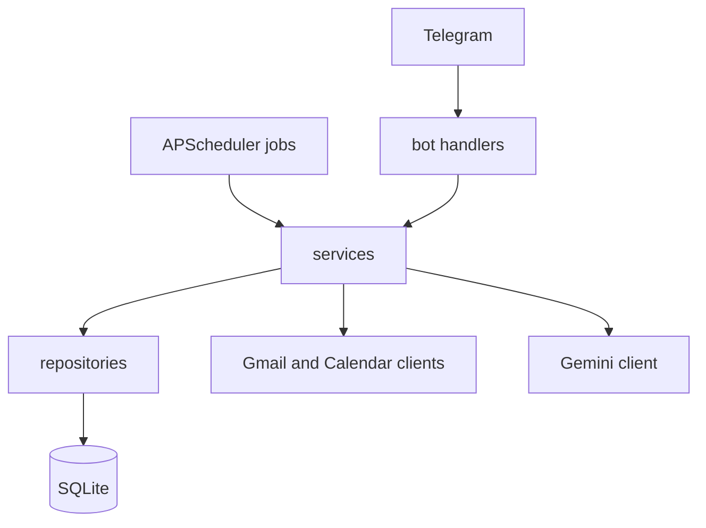

# Architecture

Telegram is the only interface. Handlers and scheduler jobs parse input, call one service, and format the reply. Services own the rules. Repositories own SQL. Google and Gemini clients own the network.

Email content is untrusted. It is wrapped in `untrusted_data` blocks before any model call. Classification JSON is data. It cannot send mail, change the calendar, or call tools. Those actions start only from your Telegram text or a button, and mutating actions still wait on `ApprovalService`.

Sync stores a Gmail history id. A later Pub/Sub push handler can call `SyncService` with the same message ids. Demo mode swaps in fixture-backed clients so the rest of the pipeline stays real.

## File map

- `app/main.py` starts migrations, the scheduler, health port, and Telegram polling.
- `app/config.py` loads one `Settings` object from the environment.
- `app/constants.py` holds enums and callback prefixes.
- `app/exceptions.py` is the application error hierarchy.
- `app/bot/app.py` registers command, message, and callback handlers.
- `app/bot/middleware.py` enforces the Telegram allowlist and the pause switch.
- `app/bot/handlers/commands.py` handles slash commands.
- `app/bot/handlers/messages.py` routes free text through edits or the intent router.
- `app/bot/handlers/callbacks.py` dispatches inline buttons.
- `app/bot/keyboards.py` builds inline keyboards.
- `app/bot/formatters.py` builds HTML message text.
- `app/bot/sender.py` sends scheduled messages.
- `app/google/auth.py` refreshes OAuth tokens and stores them encrypted.
- `app/google/gmail_client.py` wraps the Gmail REST API and the demo mailbox.
- `app/google/gmail_parser.py` parses MIME, HTML, and attachment metadata.
- `app/google/calendar_client.py` wraps the Calendar API and the demo calendar.
- `app/google/http.py` maps HTTP status codes and retries.
- `app/ai/gemini_client.py` calls Gemini with JSON schema output and retries.
- `app/ai/schemas.py` validates every model response.
- `app/ai/prompts/` holds one prompt file per task.
- `app/ai/classifier.py` classifies mail, using heuristics before the model for bulk mail.
- `app/ai/drafter.py` drafts replies.
- `app/ai/summarizer.py` summarizes threads, attachments, and the briefing focus line.
- `app/ai/searcher.py` answers questions from retrieved rows.
- `app/ai/intent_router.py` turns an owner message into a structured intent.
- `app/services/` holds business logic. `container.py` wires it.
- `app/db/` holds the engine, models, repositories, and Alembic migration.
- `app/scheduler/` polls Gmail, sends reminders, and expires approvals.
- `app/utils/` holds encryption, retries, dates, and logging.

## Schema

`emails` stores each Gmail id once. `email_analyses` stores the classification. `tasks`, `deadlines`, `calendar_events`, and `followups` are derived records. `approvals` holds encrypted payloads until you confirm or they expire. `audit_logs` is append-only. `oauth_tokens` stores ciphertext only. `contacts` and `preferences` are the personalization state you can inspect with `/preferences`.
